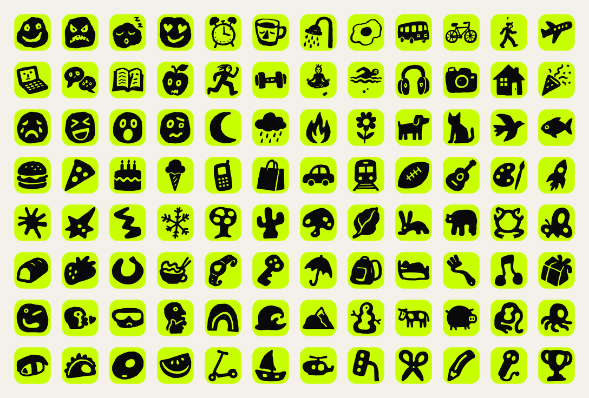

# Iconic Drills Pack

A rough, hand-drawn icon system by **Roman Kuzhel, Kyrgyzstan** that works both as scalable SVG illustrations and as custom emoji.

**[Browse the searchable icon catalog](https://roblo3x.github.io/iconic-drills-pack/)**

> Alpha release: the repository currently contains the first 96 visually approved icons. More icons will be added after review.



## Formats

Every approved drawing is distributed in four forms:

- `illustration/*.svg` — transparent, monochrome SVG using `currentColor`;
- `emoji-svg/*.svg` — black artwork on the Ddrills acid-lime field (`#C8FF00`);
- `emoji-png/128/*.png` — compact custom emoji for services such as Slack;
- `emoji-png/256` and `emoji-png/512` — higher-resolution exports.

The master artwork uses a `256 × 256` viewBox and a 24 px safe area. Unicode code-point sequences are stable IDs; names and categories remain metadata.

## Install

```sh
npm install github:roblo3x/iconic-drills-pack#v0.1.0-alpha.1
```

Publishing to the npm registry is planned after the public alpha review.

```js
import { getAssetPath, getIcon, searchIcons } from 'iconic-drills-pack';

getIcon('🍎');
// { id: '1F34E', emoji: '🍎', name: 'red apple', ... }

getAssetPath('🍎', 'illustration');
// illustration/1F34E.svg

searchIcons('travel');
```

Bundlers that support asset imports can address individual assets through package exports:

```js
import appleUrl from 'iconic-drills-pack/illustration/1F34E.svg';
```

For inline emoji on the web:

```css
.iconic-emoji {
  display: inline-block;
  width: 1em;
  height: 1em;
  vertical-align: -0.14em;
}
```

## Build and verify

```sh
npm install
npm test
npm run pack:check
npm run site:test
```

The build derives every public format from the master SVG. Validation rejects fixed dimensions, unsafe SVG elements, external references, duplicate IDs, missing builds, and oversized 128 px emoji PNGs.

The static catalog generates one crawlable page per icon, structured image-license metadata, XML and image sitemaps, crawler rules, and an `llms.txt` index for AI-assisted discovery.

## Licenses

- Package code: MIT — see [`LICENSE-CODE`](LICENSE-CODE).
- Icon artwork: CC BY 4.0 — see [`LICENSE-ICONS`](LICENSE-ICONS) and [`ATTRIBUTION.md`](ATTRIBUTION.md).
- Unicode names and grouping metadata: Unicode License v3 — see [`LICENSE-UNICODE`](LICENSE-UNICODE) and [`THIRD_PARTY_NOTICES.md`](THIRD_PARTY_NOTICES.md).

Commercial use is permitted only under the CC BY 4.0 terms, including attribution to **Roman Kuzhel, Kyrgyzstan**. A ready-to-copy credit is provided in [`ATTRIBUTION.md`](ATTRIBUTION.md).

The artwork is AI-assisted, human-directed, selected, edited, vectorized, and curated by Roman Kuzhel. No OpenMoji artwork is included.
